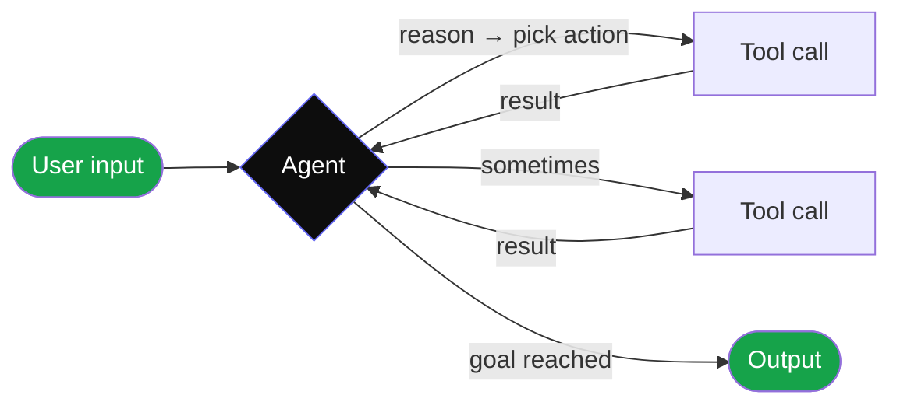
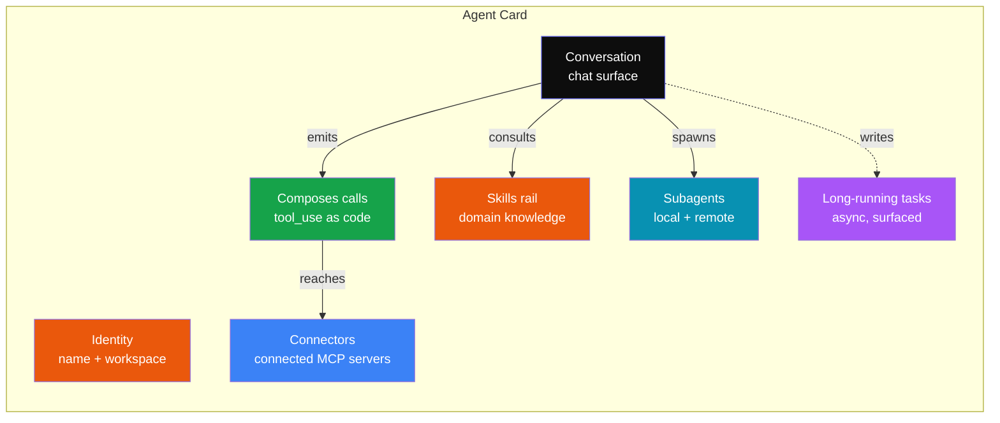
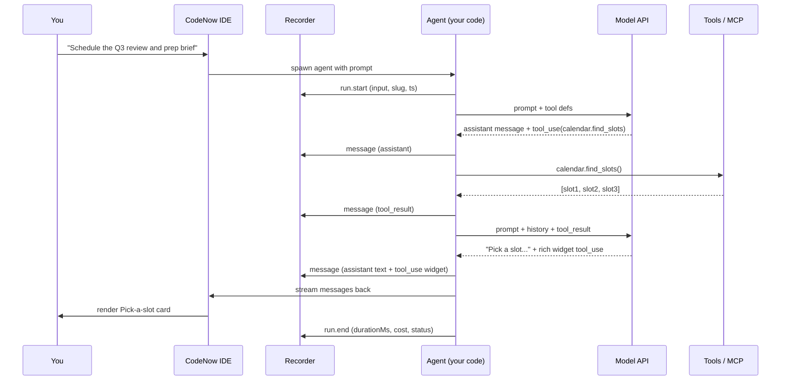
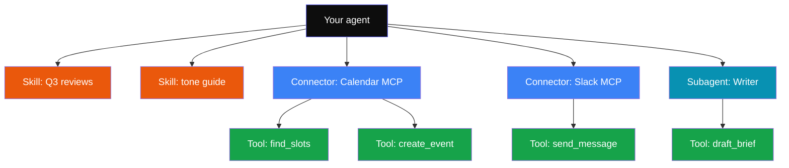

# What is an agent?

An **agent** is a program that decides, in a loop, what to do next based on a goal you give it. It's not a single API call — it's a small autonomous worker that can read, write, call tools, ask for help, and stop when it's done.

import { Callout, Cards } from 'nextra/components';

<Callout type="info">
  The vocabulary on this page comes from CodeNow's [Anatomy](/concepts/mental-model) view. The patterns are adapted from the open-source [Agentic Design Patterns](https://github.com/evoiz/Agentic-Design-Patterns) book by Evoiz, with permission.
</Callout>

## The core loop

Strip everything else away and an agent is this:

The agent loops between **thinking** (the model decides what to do) and **acting** (calling a tool, reading a file, sending a message). It stops when it decides the goal is reached.

That's it. Everything else — skills, harnesses, replay, manifests — is plumbing around this one loop.

## The seven elements of an agent

Anthropic's "2026 Agent" mockup names seven distinct things every real agent has. CodeNow's Anatomy view shows all seven.

| # | Element | What it is | Where it lives |
|---|---|---|---|
| 1 | **Identity** | Name, slug, owner, model preference | The manifest |
| 2 | **Skills** | Reusable domain knowledge — prompts, examples, expected behaviors | `.codenow/skills.json` (project-global) |
| 3 | **Conversation** | The user-facing chat surface — input + assistant response + tool calls | The Anatomy chat pane |
| 4 | **Composes calls** | The agent's tool-use sequences — `bash(cmd)`, `drive.search(q)`, `calendar.create_event(slot)` | Captured in the run's JSONL |
| 5 | **Connectors** | The MCP servers the agent can reach — Calendar, Gmail, Slack, custom | `~/.codenow/connections.json` |
| 6 | **Long-running tasks** | Async work surfaced in the status bar — indexing, watching, monitoring | The recorder + status bar |
| 7 | **Subagents** | Other agents (local or remote) this agent can delegate to | `manifest.tools` for declared, observed in runs |

## How a turn actually flows

When you type a message and hit Enter:

CodeNow's **recorder** wraps your agent's stream so every event lands in `.codenow/runs/{slug}/{ts}-{runId}.jsonl`. The Replay viewer reads those files later — there's no service to install.

## Skill vs Tool vs Connector vs Subagent

These four words are easy to confuse. Quick map:

- **Skill** — a piece of *knowledge*: "you handle Q3 reviews like this." Sent as part of the system prompt. Doesn't execute anything.
- **Tool** — a *function* the agent can call: `calendar.create_event(slot, attendees)`. Executes code or makes a network call, returns a result.
- **Connector** — a *server* that hosts a set of tools: the Google Calendar MCP server provides `find_slots`, `create_event`, `cancel_event` tools. One connector, many tools.
- **Subagent** — *another agent* this agent can spawn. Has its own identity, skills, tools, conversation. Useful for delegation: "ask the writing agent to draft the brief."

## Common patterns

A handful of patterns show up over and over. Each is a building block — you mix them to compose real agents.

### Pattern: ReAct (Reason + Act)
The default loop. Model thinks → calls a tool → reads the result → thinks again → eventually decides "done." This is what every Claude / GPT / Gemini agent does by default.

### Pattern: Plan-then-execute
The model first writes a multi-step plan as text, then executes each step as a tool call. Better for complex tasks; longer runs.

### Pattern: Subagent delegation
The top-level agent identifies a sub-task and spawns a specialized subagent for it (writer, researcher, reviewer). Each subagent has its own context window and tool palette.

### Pattern: Human-in-the-loop (HITL)
The agent emits a `tool_use` with `requires_approval: true`. CodeNow renders this as an **Approve / Deny** widget in the conversation. The agent pauses until the human decides. The audit trail captures who approved and when.

### Pattern: Rich app interaction
The agent emits a `tool_use` shaped like a UI widget — e.g. `pick_slot` with `args.choices`. CodeNow renders the widget (a Pick-a-slot card with three buttons) and feeds the user's selection back as the next turn. Anthropic's "MCP App" pattern.

## Reading further

<Cards>
  <Cards.Card title="Harnesses" href="/concepts/harnesses" arrow>
    The runtime + harness around your agent — Claude SDK, Cursor SDK, Microsoft, Google. What's different about each and when to pick which.
  </Cards.Card>
  <Cards.Card title="Runs and replay" href="/concepts/runs" arrow>
    How every agent invocation is captured as JSONL, why that matters, and how the Fork-to-current-code flow works.
  </Cards.Card>
  <Cards.Card title="Manifests and provenance" href="/concepts/manifests" arrow>
    The agent's identity card — built-by, runs-at, data-access scopes, prompts, evals, tool signatures. How forking preserves provenance.
  </Cards.Card>
  <Cards.Card title="The 2026 Agent (mental model)" href="/concepts/mental-model" arrow>
    Anthropic's visual mental model and how it maps to CodeNow's Anatomy view. The page that prints well as a printable cheat sheet.
  </Cards.Card>
</Cards>
